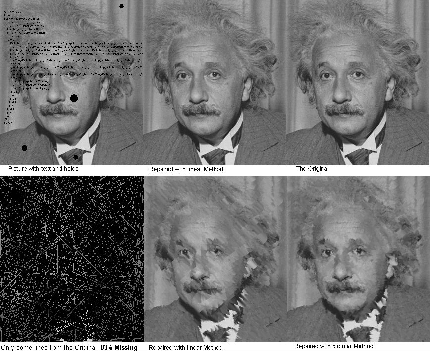



## Image Reapair \(simple Version\)

### Description

Updated (Better Repair and selection Methods)

Remove Text, fill holes ... Repair Pictures.

See Screenshot

This code usess a Method similar to the Poisson Fill.It&#180;s no real Inpaint like described in the SIGGRAPH Paper from 2003 but in simpler cases it does good work.
 
### More Info
 

             |
---                |---
**Submitted On**   |2008-12-25 07:50:02
**By**             |[Scythe](https://github.com/Planet-Source-Code/PSCIndex/blob/master/ByAuthor/scythe.md)
**Level**          |Intermediate
**User Rating**    |5.0 (20 globes from 4 users)
**Compatibility**  |VB 5\.0, VB 6\.0
**Category**       |[Graphics](https://github.com/Planet-Source-Code/PSCIndex/blob/master/ByCategory/graphics__1-46.md)
**World**          |[Visual Basic](https://github.com/Planet-Source-Code/PSCIndex/blob/master/ByWorld/visual-basic.md)
**Archive File**   |[Image\_Reap21381312252008\.zip](https://github.com/Planet-Source-Code/scythe-image-reapair-simple-version__1-71544/archive/master.zip)

